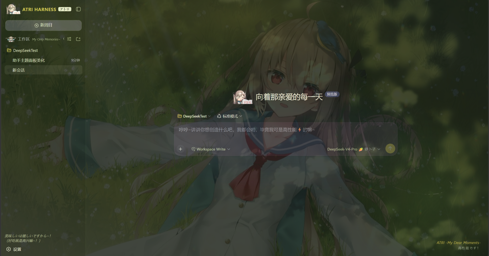
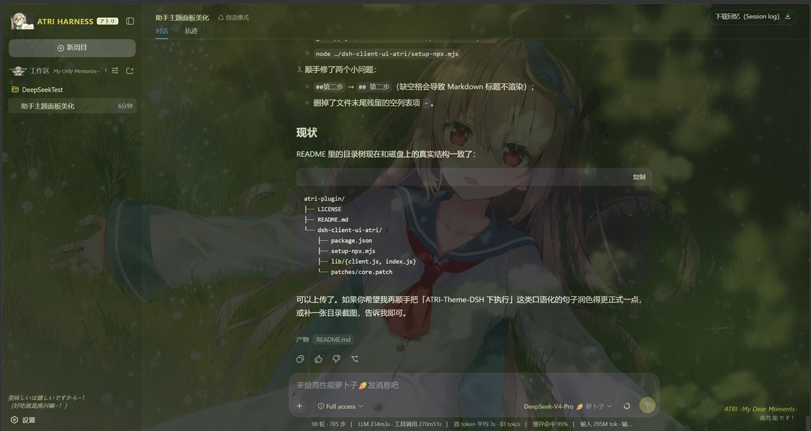
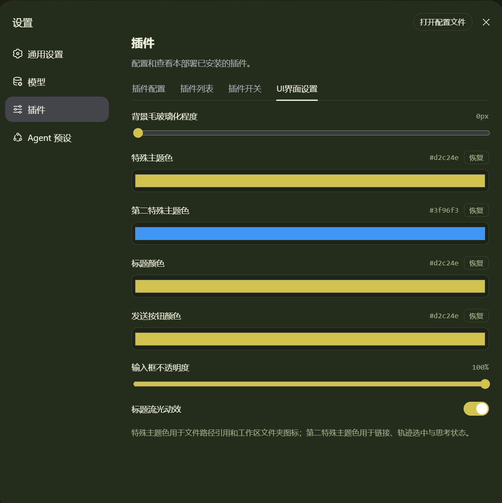

# ATRI 主题插件 · `@dkthree/dsh-client-ui-atri`

[](https://www.npmjs.com/package/@dkthree/dsh-client-ui-atri)
[](LICENSE)

《ATRI -My Dear Moments-》主题的 DeepSeek Harness Web 界面美化插件，已发布到 [npm](https://www.npmjs.com/package/@dkthree/dsh-client-ui-atri)。

绝大部分功能是**纯视觉主题**，装完即用；只有「UI 界面设置」和「侧栏加宽 15px」需要给核心打一个小补丁。

## 功能

- 全屏 ATRI 背景壁纸 + 橄榄绿 / 向日葵金配色（深色 / 浅色两套）
- 左上角 `ATRI HARNESS` + `アトリ` 徽章 + Atri 图标
- 右下角标题流光动效（带开关）
- 新对话空态：Atri 图标 +「向着那亲爱的每一天」
- 侧栏底部标签、工作区图标、「My Only Memories~」小字
- 文案替换：Session log → 下载回忆、推理等级（笨蛋机器人 / 萝卜子 / 高性能です！）、输入框占位符、发送按钮等
- 链接 / 轨迹选中 / 思考状态 / 对话·轨迹标签选中的颜色
- **UI 界面设置**：毛玻璃程度、特殊主题色 ×2、标题颜色、发送按钮颜色、输入框不透明度、流光开关（各带重置按钮）

## 展示效果







## 目录结构

```
ATRI-Theme/
├── LICENSE              ← 许可证（MIT）
├── README.md            ← 本文件（安装说明）
├── assets/              ← 展示截图（3 张 JPEG）
└── dsh-client-ui-atri/  ← 插件本体（发布到 npm 的就是它）
    ├── package.json
    ├── README.md        ← npm 包说明
    ├── LICENSE
    ├── bin/atri.mjs     ← 一键安装器（install / patch / uninstall）
    ├── setup-npx.mjs    ← 核心补丁脚本（bin 的 patch 也会调它）
    ├── lib/
    │   ├── client.js    ← 全部视觉主题 + 设置页逻辑
    │   └── index.js     ← node 半（注册 atri-ui 设置命名空间）
    └── patches/
        └── core.patch   ← 源码版用的核心补丁
```

---

## 一键安装（npm，推荐）

```bash
npx @dkthree/dsh-client-ui-atri install
```

这一条命令会：把插件复制进你的 web profile（`~/.dsh/profiles/web/node_modules/`）**并**在 `cordis.patch.yml` 里注册 `ui-atri`，实现一启动就加载主题。

然后重启 `dsh web`，浏览器 `Ctrl+Shift+R` 强制刷新，主题即生效。

（可选）启用「UI 界面设置」+「侧栏加宽 15px」：

```bash
npx @dkthree/dsh-client-ui-atri patch
```

> 可用环境变量 `DSH_HOME` 覆盖 profile 根目录（默认 `~/.dsh`）。

---

## 手动安装（不想用 npx 时）

### 第一步：把插件放进 web profile

1. 把 `dsh-client-ui-atri` 整个目录复制到你的 web profile：

   - Windows：`C:\Users\<你>\.dsh\profiles\web\node_modules\@dkthree\dsh-client-ui-atri\`
   - Linux / macOS：`~/.dsh/profiles/web/node_modules/@dkthree/dsh-client-ui-atri/`

2. 在 web profile 的 `cordis.patch.yml`（即 `~/.dsh/profiles/web/cordis.patch.yml`）里注册，实现一启动就加载主题：

   ```yaml
   - insert:
       - id: ui-atri
         name: '@dkthree/dsh-client-ui-atri'
   ```

> 做完这一步，**纯视觉主题（壁纸、配色、品牌区、图标、文案替换、链接/轨迹/思考颜色等）就已经生效了**。下面的第二步只是为了让「UI 界面设置」页和「侧栏加宽」可用。

### 第二步：启用「UI 界面设置」+「侧栏加宽 15px」

#### 方式 A：源码运行（`pnpm dsh web`，你有 checkout）

在 DeepSeek Harness 的 checkout 根目录下执行：

```bash
git apply /path/to/ATRI-Theme/dsh-client-ui-atri/patches/core.patch
pnpm build:lib:host     # 让 atri-ui 设置命名空间生效
pnpm build:lib:client   # 让侧栏加宽 15px 生效
pnpm dsh web            # 重启
```

#### 方式 B：npm / npx 安装运行（`npx @deepseek-ai/dsh web` 或 `dsh web`）

```bash
node /path/to/ATRI-Theme/dsh-client-ui-atri/setup-npx.mjs
```

（等价于 `npx @dkthree/dsh-client-ui-atri patch`。）

脚本会自动在「全局 npm 目录」和「npx 缓存目录」里找到 `dsh-host-apiproxy` 和 `dsh-client-ui-layout` 并修改。如果找不到，手动指定 node_modules 根目录：

```bash
node /path/to/ATRI-Theme/dsh-client-ui-atri/setup-npx.mjs "<node_modules 根目录>"
```

然后重启 `dsh web`，浏览器 `Ctrl+Shift+R` 强制刷新。

> 注意：npm/npx 安装版的补丁是改在已安装的包里的，**重新安装 / 升级 dsh 后会失效**，需要重新跑一次脚本。源码版用 `git apply` 则会一直留在你的改动里。

---

## 如何卸载

```bash
npx @dkthree/dsh-client-ui-atri uninstall
```

> ⚠️ **不要只删插件目录。** DSH 启动时会解析 `cordis.patch.yml` 里注册的每个插件，目录删了但注册还在 → 直接 **Failed Loader** 进不去。

正确顺序（两步一起）：

1. 移除注册（`npx @dkthree/dsh-client-ui-atri uninstall`，或手动打开 `~/.dsh/profiles/web/cordis.patch.yml` 删掉 `ui-atri` 这一条）：

   ```yaml
   - insert:
       - id: ui-atri
         name: '@dkthree/dsh-client-ui-atri'   # ← 删掉这 3 行
   ```

2. （可选）再删插件目录 `~/.dsh/profiles/web/node_modules/@dkthree/dsh-client-ui-atri/`。

> - 只删 yaml 条目、留着目录 = **安全**（没被注册的目录不会被加载）；
> - 只删目录、留着 yaml 条目 = **Failed Loader**；
> - 注意 `disabled: true` 也只是「不激活」，加载器仍要解析该包，所以 `disabled: true` 的插件目录同样不能乱删。

---

## 常见问题

- **设置页没反应 / 报 `settings-not-exposed`**：说明还没打核心补丁（`patch` 或源码 `git apply`）。
- **侧栏没有变宽**：同上，需要 `patch` / `pnpm build:lib:client` 生效后重启。
- **启动报 `Failed Loader`**：几乎都是 `cordis.patch.yml` 里注册的插件目录被删/缺失导致的，按上面卸载顺序先清掉 yaml 条目即可。

## 发布（维护者用）

```bash
cd dsh-client-ui-atri
npm publish
```

> `package.json` 已配置 `publishConfig.access = "public"`，无需再加 `--access public`。

## 相关链接

- npm 包：<https://www.npmjs.com/package/@dkthree/dsh-client-ui-atri>
- 源码 / 反馈问题：<https://github.com/DKthreeFR/ATRI-Theme-DSH>

## 许可证

[MIT](LICENSE) © 2026 DKthreeFR
